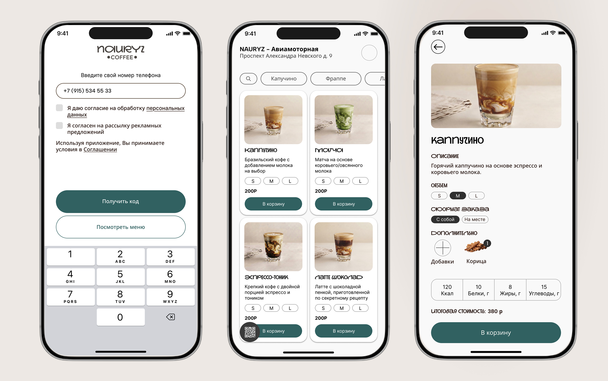
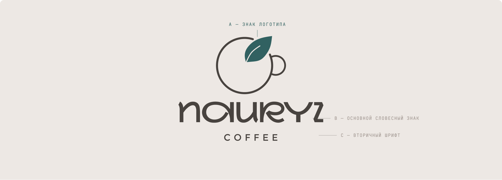
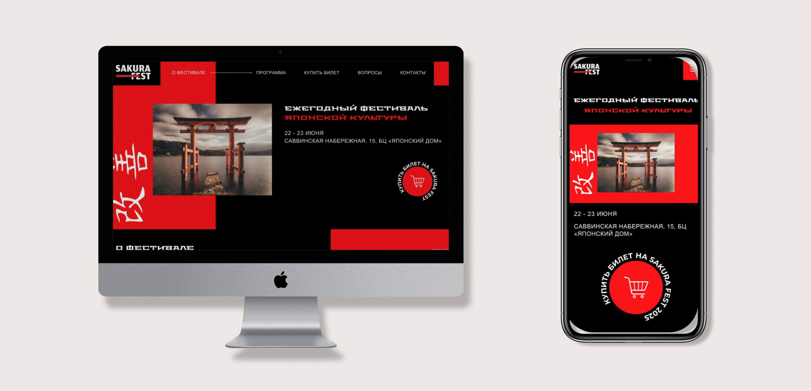
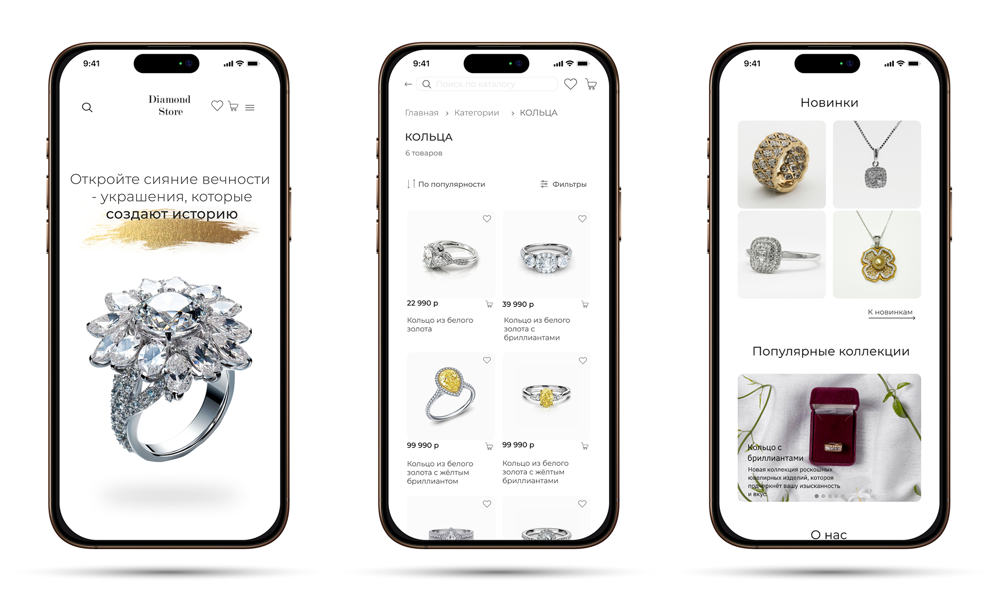

<table width="100%" cellspacing="0" cellpadding="0">
  <tr>
    <td align="left" valign="top" width="50%">
      <h1 align="left">Пичикова Валерия</h1>
      <h3>Продуктовый UX/UI Дизайнер</h3>
    </td>
    <td align="right" valign="middle" width="50%">
      
      
    </td>
  </tr>
</table>

  

  

    
    
    
    
    
  

## Содержание
- [Обо мне](#обо-мне)
- [Избранные кейсы](#избранные-кейсы)
  - [Nauruz Coffee App](#nauruz-coffee-app--мобильное-приложение-для-кофейни)
  - [Nauruz Coffee Branding](#nauruz-coffee--брендинг-и-айдентика)
  - [Корпоративные системы (NDA)](#корпоративные-системы-и-дашборды-nda)
  - [АСУК](#автоматизированная-система-учета-кадров-предприятия)
  - [Sakura Fest](#sakura-fest--веб-сайт-фестиваля-японской-культуры)
  - [Diamond Store](#diamond-store--ювелирный-интернет-магазин)
- [Мои навыки](#мои-навыки)

---

## Обо мне
Продуктовый UX/UI-дизайнер с опытом 3 года: от контент-дизайна и фриланс-проектов до ведения продуктовых задач в компании. Обучаюсь на основной ветке UX/UI-дизайна в Школе 21 и прошла программу «Веб-дизайнер» в Яндекс Практикуме. 

Благодаря базе Школы 21 и инженерному образованию понимаю логику разработки и говорю с инженерами на одном языке. Умею вести проект целиком: исследование, прототип, UI, передача в разработку.

## Мои навыки

| Направление | Инструменты и технологии |
| :--- | :--- |
| **Design** | Figma, Prototyping, User Research, Wireframing, Design Systems, UI/UX, Branding |
| **Development** | HTML5, CSS3, Basic JavaScript |
| **No-code** | Tilda, Webflow |
| **Tools** | Git, Miro, Notion, FigJam |

 <a href="./assets/pdf/UI-Designer.pdf"><b>Открыть мое резюме в PDF</b></a>

---

## Кейсы

### Nauruz Coffee App — Мобильное приложение для кофейни

**Краткое описание:** Мобильное приложение для сети кофеен, которое позволяет пользователям найти ближайшую кофейню, просмотреть меню, кастомизировать заказ добавками и получать бонусы программы лояльности через QR-код.

**Задача:** Увеличить частоту покупок кофе и упростить процесс заказа для постоянных гостей.

**Проблема и ключевые решения:** Спроектировала мобильное приложение с бесшовным путем к кофе, программой лояльности в один тап и интуитивным поиском. Интегрировала бонусную систему в основной флоу заказа, что сократило путь пользователя до минимума и повысило вовлеченность.

  

<b>Подробнее о процессе и UI</b>

 

**Ключевые принципы опыта:**
- Бесшовный путь к кофе
- Интуитивный поиск и кастомизация меню
- Опыт взаимодействия с продуктом на каждом этапе
- Определение успешных KPI

**Экраны приложения:**
- Онбординг и авторизация
- Главный экран с персонализированными рекомендациями
- Меню с фильтрами и кастомизацией
- Корзина и оформление заказа
- Программа лояльности и бонусы
- Профиль пользователя

**Дизайн-система:**
- Цветовая палитра, отражающая атмосферу кофейни
- Типографика для мобильного интерфейса
- Компоненты UI Kit для iOS и Android

📄 <a href="./assets/pdf/nauryz.pdf"><b>Открыть кейс в PDF</b></a>

 

### Nauruz Coffee — Брендинг и Айдентика

**Краткое описание:** Разработка фирменного стиля для кофейни: логотип, айдентика, гайдлайн.

**Задача:** Создать уникальный визуальный образ для кофейни, передающий атмосферу тепла, ремесла и восточного гостеприимства.

**Проблема и ключевые решения:** Разработала логотип, основанный на концепции тепла и ремесленного подхода к созданию кофе. Создала полную систему брендбука с адаптацией под digital и print, включая строгие правила масштабирования и использования.

  

<b>Подробнее о процессе брендинга</b>

 

**Технические спецификации:**
- **Форматы:** SVG, PNG, PDF, EPS
- **Версии логотипа:** Основная, минимальная, монохромная
- **Clear Space:** Минимальная зона защиты вокруг логотипа
- **Minimum Size:** Цифровой и печатный минимальный размер

**Применение бренда:**
- Цифровые носители: сайт, приложение, соцсети
- Печатная продукция: меню, упаковка, визитки
- Наружная реклама: вывески, баннеры
- Мерч: чашки, футболки, пакеты

**Гайдлайн включает:**
- Правила использования логотипа
- Цветовую систему и типографику
- Примеры правильного и неправильного использования
- Шаблоны для различных носителей

📄 <a href="./assets/pdf/logo.pdf"><b>Открыть гайдлайн в PDF</b></a>

 

### Корпоративные системы и дашборды (NDA)

**Краткое описание:** Проектирование внутренних корпоративных систем, CRM и аналитических дашбордов для B2B-сектора. Из-за соглашений о неразглашении (NDA) визуальные материалы скрыты, однако ниже представлены структурированные данные о решенных бизнес-задачах и методологии.

**Задача:** Создать удобные интерфейсы для работы с большими объемами данных, автоматизации бизнес-процессов и повышения операционной эффективности команд.

**Проблема и ключевые решения:** Спроектировала интуитивные интерфейсы для сложных корпоративных задач. Упростила работу с данными, внедрила систему умной фильтрации, ролевой модели доступа и визуализации метрик, что позволило сократить время сотрудников на выполнение рутинных операций.

<b> Матрица анонимизированных проектов и бизнес-результатов</b>

 

| Тип системы | Ключевая проблема бизнеса | Дизайн-решение | Измеримый результат (Impact) |
| :--- | :--- | :--- | :--- |
| **B2B CRM-система** | Высокий порог входа для новых менеджеров, длительная обработка заявок. | Редизайн онбординга, внедрение пошаговых форм и умных подсказок при вводе данных. | Сокращение времени обучения новых сотрудников, рост скорости обработки заявки. |
| **Аналитический дашборд** | Перегруженность интерфейса, руководителям сложно быстро считать ключевые KPI. | Модульная сетка виджетов, кастомизируемые фильтры в реальном времени, цветовое кодирование статусов. | Время на формирование еженедельного отчета сократилось. |
| **Система документооборота** | Частые ошибки при согласовании документов из-за неочевидных статусов. | Внедрение визуального трекера статусов, цветовая индикация ошибок и валидация полей на лету. | Снижение количества возвратов документов на доработку. |

<b> Профессиональные стандарты и процесс работы</b>

 

Помимо визуального дизайна, я выстраиваю прозрачный процесс передачи макетов в разработку, что минимизирует ошибки и ускоряет релиз.

| Этап работы | Инструменты и подходы | Результат для команды |
| :--- | :--- | :--- |
| **Исследование** | CustDev, Heuristic Evaluation, Jobs To Be Done, анализ конкурентов. | Четкое понимание болей пользователей и приоритизация гипотез. |
| **Прототипирование** | Wireframing, интерактивные прототипы в Figma, тестирование гипотез. | Валидация UX-решений до начала дорогостоящей разработки. |
| **Дизайн-система** | Atomic Design, Variables, Auto Layout, компонентный подход. | Единообразие интерфейса и возможность масштабирования продукта. |
| **Передача в разработку** | Figma Dev Mode, подробные аннотации. | Разработчики получают исчерпывающую информацию, количество вопросов в процессе верстки сведено к минимуму. |

*Примечание: Детальные скриншоты, названия компаний и точные метрики конкретных проектов не доступны.*

 

### Автоматизированная система учета кадров предприятия

**Краткое описание:** Full-stack веб-приложение для автоматизации кадрового учета среднего промышленного предприятия. Спроектировано и реализовано самостоятельно: от UX-исследования и дизайна интерфейсов до серверной логики, базы данных и клиентской части.

**Задача:** Упростить работу кадровой службы предприятия, заменив бумажный документооборот и устаревшие системы на современное, экономически эффективное веб-решение.

**Проблема и ключевые решения:** Проведен сравнительный анализ рынка — выявлен структурный пробел: ни одно решение не сочетает функциональную глубину, современный интерфейс и доступную стоимость для средних промышленных предприятий. Спроектировала и разработала full-stack решение: UX/UI дизайн + Node.js/Express backend + React/TypeScript frontend + PostgreSQL. Внедрила ролевой доступ, умную фильтрацию в реальном времени, дашборд руководителя с аналитикой и модуль документооборота.

**Ключевые результаты:**
- Ролевая модель доступа - HR, руководитель, администратор, рядовой стордуник с разграничением прав
- Картотека сотрудников с многофакторной фильтрацией без перезагрузки страницы
- Дашборд руководителя с визуализацией KPI, текучести и найма
- Документооборот: заявки на отпуск, приказы, согласования в едином модуле
- Адаптивная верстка под Desktop, Tablet и Mobile
- Стабильная работа при ошибках ввода и сбоях БД

  <video width="100%" controls autoplay muted loop playsinline style="display: block;">
    <source src="./assets/video/HR.mp4" type="video/mp4">
    Ваш браузер не поддерживает видео.
  </video>

Демонстрация работы дашборда АСУК

<b>Подробнее о проекте</b>

 

**Роль:** UX/UI Designer + Full-stack Developer  

**Технологический стек:**
- **Backend:** Node.js, Express.js, PostgreSQL 
- **Frontend:** React, TypeScript, Vite, React Router, Axios
- **Визуализация:** Recharts 
- **Безопасность:** bcrypt, JWT, защита маршрутов, CORS

**Архитектура базы данных:**
Нормализованная реляционная модель в PostgreSQL с ссылочной целостностью:
- Сотрудники, Подразделения, Должности 
- Пользователи с ролевым доступом 
- Отпуска, Заявки на отпуск 
- Приказы 
- Карьерные записи 

**Ключевые экраны системы:**
- **Авторизация:** форма входа с валидацией и защитой от дублирования запросов
- **Картотека сотрудников:** панель фильтров + сетка карточек с цветными индикаторами статуса
- **Карточка сотрудника:** вкладки «Основные сведения», «Рабочая информация», «Контакты», «Документы», «История»
- **Форма добавления/редактирования:** валидация, обработка конфликтов 
- **Дашборд руководителя:** виджеты KPI, круговые диаграммы по филиалам и должностям, график найма по месяцам
- **Отчеты:** сотрудники по отделам, текучесть кадров, календарь отпусков, карьерный рост
- **Документы:** три вкладки — «Заявки», «Утверждение», «Приказы» с модальным окном формирования приказа

**Методология:**
- Design Thinking 
- Компонентный подход
- Строгая типизация для надежности

**Тестирование:**
- Проверка аутентификации и защиты маршрутов
- Комбинированная работа фильтров в реальном времени
- Обработка ошибок

*Исходный код хранится в отдельном архиве с названием "ASUK".*

 

### Sakura Fest — Веб-сайт фестиваля японской культуры

**Краткое описание:** Редизайн лендинга фестиваля с онлайн-продажей билетов и адаптацией под все устройства.

**Задача:** Создать современный адаптивный сайт с интеграцией онлайн-продажи билетов, передающий атмосферу японской культуры.

**Проблема и ключевые решения:** Существующий сайт не отвечал современным стандартам UX и не позволял продавать билеты онлайн. Полностью переосмыслила дизайн с нуля: провела UX-исследование, создала адаптивные макеты для трёх устройств (Desktop 1440px, Tablet 768px, Mobile 375px), разработала UI Kit из 30+ компонентов и подготовила 100% хэндофф для разработчиков.

  

<b>Подробнее о процессе работы</b>

 

**Целевая аудитория:**
- **Мария, 22** — аниме-фанат, ищет мастер-классы и косплей-конкурс
- **Алексей, 34** — гастроном, интересуется японской кухней
- **Елена, 40** — родитель, ищет семейную программу

**Процесс работы:**
1. **Исследование:** анализ конкурентов, аудит существующего сайта, интервью с организаторами, составление персонажей и сценариев использования.
2. **Информационная архитектура:** разработка структуры сайта, пользовательских путей, wireframes для всех трёх брейкпоинтов.
3. **Визуальный дизайн:** создание hi-fi макетов, проработка цветовой системы (#0A0A0A, #C8292B, #FFFFFF), типографики (Stalinist One, T-FLEX Type) и сетки.
4. **UI Kit & Handoff:** систематизация компонентов, описание стилей и состояний, подготовка файлов для разработчиков.

**Метрики проекта:**
- 3 брейкпоинта (Desktop 12 колонок, Tablet 8, Mobile 4)
- 11 секций сайта от хеддера до футера
- 30+ UI компонентов в дизайн-системе

📄 <a href="./assets/pdf/fest.pdf"><b>Открыть кейс в PDF</b></a>

 

### Diamond Store — Ювелирный интернет-магазин

**Краткое описание:** Интернет-магазин ювелирных украшений с luxury-эстетикой для iOS, Android и Desktop.

**Задача:** Создать премиальный интернет-магазин с фокусом на визуальную презентацию продукта и оптимизацию пути к покупке.

**Проблема и ключевые решения:** Разработала кроссплатформенный дизайн с luxury-эстетикой, где интерфейс минималистичен и не отвлекает от продукта, а навигация интуитивна и ведёт к покупке. Внедрила плавные переходы и акцент на высококачественных фотографиях.

  

<b>Подробнее о проекте</b>

 

**Процесс работы:**
1. Исследование рынка luxury-сегмента и анализ лучших практик
2. Проектирование пользовательских сценариев
3. Создание wireframes и интерактивных прототипов
4. Визуальный дизайн с акцентом на премиальность
5. Адаптация под все платформы 

**Ключевые экраны:**
- Главная с hero-секцией и коллекциями
- Каталог с фильтрами и сортировкой
- Карточка товара с детальной информацией
- Корзина и оформление заказа
- Личный кабинет и история заказов

📄 <a href="./assets/pdf/shop.pdf"><b>Открыть кейс в PDF</b></a>

---

 

  
Открыта к новым проектам и full-time работе

  

